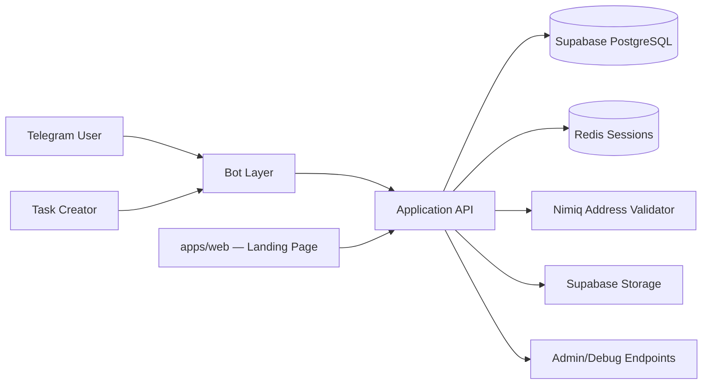
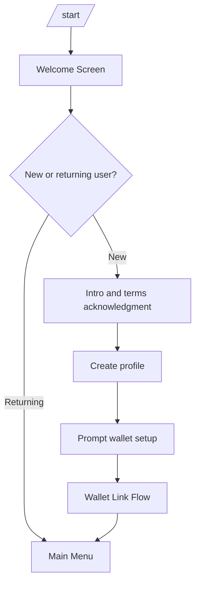
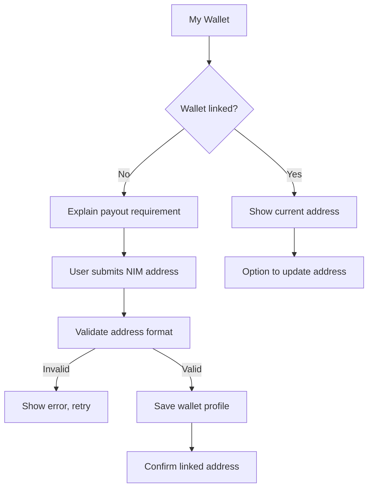
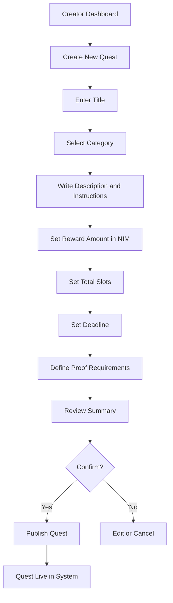
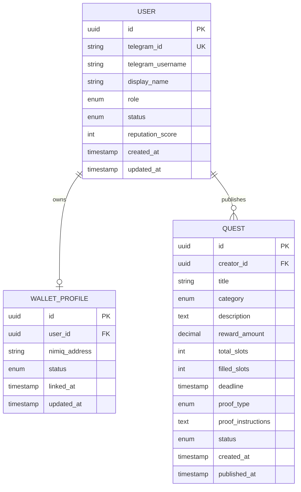

# Milestone 1 — Core MVP Infrastructure

**Project:** NimiqEarn Quest  
**Founder:** David Patrick Chuks  
**Milestone:** 1 of 3  
**Funding:** $2,000 USD (or NIM equivalent)  
**Payment received:** June 15, 2026  
**Delivery window:** Weeks 1–2 (June 15 – June 29, 2026)  
**Next milestone payment:** July 1, 2026 (Milestone 2)

**Repository:** [github.com/David-patrick-chuks/NimiqEarn-Quest](https://github.com/David-patrick-chuks/NimiqEarn-Quest)  
**Product concept:** [docs/nimiqearn-prototype-document.md](docs/nimiqearn-prototype-document.md)  
**Verification architecture:** [docs/nimiqearn-verification-architecture.md](docs/nimiqearn-verification-architecture.md)

---

## 1. Council Approval and Commitments

NimiqEarn Quest was approved by the **Nimiq Community Council** following the Proposals & Bounties forum submission. This document is the public execution plan for Milestone 1 — the first funded phase of the approved 6-week MVP delivery.

### What the Council Approved

The council found the concept compelling and approved the proposal based on:

- a clearly defined MVP with structured milestones and deliverables
- potential to drive real Nimiq ecosystem utility and NIM transaction activity
- a serious, well-documented product and technical foundation

The full approved project scope covers a **Telegram-native task and bounty marketplace** where users complete quests, submit proof, get verified, and receive NIM rewards — built around the core loop:

> **discover tasks → submit proof → get verified → receive NIM**

### Council Requirements

During approval, the Community Council (`paulghz`) requested the following to facilitate milestone-based funding:

| Requirement | Detail |
| --- | --- |
| Public GitHub visibility | Council must be able to follow all development on the public repository to confirm milestone completion and release subsequent payments |
| Regular forum updates | Progress updates posted in the original proposal thread so the community can follow the project's evolution |
| Funding address | Nimiq address provided for milestone payments |
| Milestone payment schedule | Fixed dates for each of the three milestone releases |

### Founder Commitments (Confirmed in Forum)

David confirmed the following in response to council approval:

- All development will be **public and tracked through the GitHub repository**
- **Regular progress updates** will be posted in the Community Council forum thread
- **Funding address:** `NQ48 VAXG JD1K YSCM X6H6 DJSL AYN7 FTYF 0KAH`
- First payment requested by mid-June 2026

### Official Funding Schedule

Confirmed by the Community Council team:

| Milestone | Amount | Payment Date | Status |
| --- | --- | --- | --- |
| Milestone 1 — Core MVP Infrastructure | $2,000 | **June 15, 2026** | **Paid** |
| Milestone 2 — Marketplace and Payments | $1,500 | July 1, 2026 | Upcoming |
| Milestone 3 — Verification and Launch | $1,000 | July 15, 2026 | Upcoming |

**Total approved budget:** $4,500 USD (or NIM equivalent)

---

## 2. Approved Proposal Reference (Forum Submission)

This section records the full approved proposal as submitted to the Nimiq Community Council, so Milestone 1 execution stays traceable to the original commitment.

### What is NimiqEarn Quest?

NimiqEarn Quest is an **AI-powered Telegram task and bounty marketplace for the Nimiq ecosystem** — a Telegram-native microtask and bounty platform built around a simple reward loop:

> **discover tasks → submit proof → get verified → receive NIM**

It is designed to make NIM useful in a practical, recurring way by turning Telegram into a lightweight earning and participation channel.

### The Problem Being Solved

**Gap A — Workers:** Many users want simple online earning opportunities, but existing platforms are often:

- too complex for mobile-first users
- slow with payouts
- dependent on banking systems
- difficult to access in emerging markets
- not designed for lightweight community-driven work

**Gap B — Creators:** Web3 projects and digital communities need better tools to:

- grow and activate users
- run bounty programs
- test products quickly
- reward community participation
- recruit contributors
- execute structured engagement campaigns

NimiqEarn Quest addresses both sides by combining community incentives and instant crypto payouts in a Telegram-first experience.

### Project Goal

Increase real Nimiq ecosystem usage through repeated earning, contribution, and reward activity inside Telegram.

### Ecosystem Impact (Approved)

| Impact Area | Description |
| --- | --- |
| Wallet adoption | Drive Nimiq wallet adoption through simple onboarding |
| Transaction volume | Increase NIM transaction volume through micro-rewards |
| Payment utility | Create real-world utility for NIM payments |
| Telegram participation | Expand Telegram-native participation in the ecosystem |
| Community growth | Give communities a practical incentive layer for engagement and growth |

### Target Users (Approved)

**Workers:** students, freelancers, creators, developers, community contributors

**Task Creators:** startups, DAOs, Web3 projects, creators, marketing and growth teams

### MVP Components (Full Project)

The approved MVP combines:

| Component | Milestone |
| --- | --- |
| Telegram bot infrastructure | M1 |
| Nimiq wallet onboarding | M1 |
| Creator task publishing and management flow | M1 |
| Task marketplace (discovery + submission) | M2 |
| Instant NIM payouts | M2 |
| Deterministic verification flow | M2 |
| AI-assisted task verification | M3 |
| Reputation and anti-spam controls | M3 |
| Public beta launch | M3 |

### Budget Request (Approved — Full Project)

| Category | Amount |
| --- | --- |
| Telegram Bot Development | $1,500 |
| Nimiq Wallet + Payment Integration | $800 |
| AI Verification System | $900 |
| Backend & Infrastructure | $500 |
| UI / Dashboard (Lightweight) | $400 |
| Testing, Security & Optimization | $300 |
| Community Launch & Growth | $100 |
| **Total** | **$4,500 USD** (or NIM equivalent) |

**Budget justification:** Deliver a functional MVP that proves user demand, reliable NIM reward distribution, repeated transaction activity, and practical ecosystem utility.

### Timeline (Approved — 6 Weeks)

| Week | Focus |
| --- | --- |
| Week 1 | System architecture and Telegram bot setup |
| Week 2 | User onboarding and wallet integration |
| Week 3 | Task marketplace and submission system |
| Week 4 | NIM payout engine and verification flow |
| Week 5 | AI moderation and reputation system |
| Week 6 | Testing, optimization, and public beta launch |

**Delivery window:** June 2026 – July 2026

### Terms of Completion (Approved)

The project will be considered complete once the **MVP is live and the core reward flow is working end to end**:

1. Creator posts a quest
2. Worker discovers and completes it
3. Worker submits proof
4. System verifies the submission
5. Valid submissions are paid in NIM

### Full Deliverables (Approved Proposal)

| Deliverable | Milestone |
| --- | --- |
| Live Telegram bot for NimiqEarn Quest | M1 |
| NIM wallet onboarding flow | M1 |
| Basic quest creation and task posting | M1 |
| Working task marketplace | M2 |
| Instant payout mechanism | M2 |
| AI-assisted verification engine | M3 |
| Reputation and anti-spam controls | M3 |
| Public beta launch | M3 |

### Proof of Completion (Approved Proposal)

| Proof Item | When |
| --- | --- |
| Live product demo | Each milestone + final launch |
| Public GitHub repository | Ongoing — all milestones |
| Transaction logs for NIM payouts | Milestone 2 onward |
| Onboarding metrics | Milestone 1 onward |
| Usage analytics report | Milestone 3 (beta launch) |

### Founder Background (Approved Proposal)

**David Patrick Chuks** — full stack and blockchain developer specializing in AI agents, Telegram automation systems, and Web3 infrastructure.

Relevant experience:

- building AI agent systems, including [Riona AI](https://github.com/David-patrick-chuks/Riona-AI-Agent)
- developing Telegram bots and automation products
- shipping Web3 tools and blockchain applications
- winning 7 blockchain hackathons
- building production-ready technical products

GitHub: [github.com/davidpatrickchuks](https://github.com/davidpatrickchuks)

### Forum Discussion — Verification Q&A

During proposal review, **Paul (`paulghz`)** from the Community Board asked:

> *"Can you tell us a bit more about how would the 'submit proof, get verified (AI assisted)' part work?"*

**David's response** (summarized from the forum thread, full detail in [docs/nimiqearn-verification-architecture.md](docs/nimiqearn-verification-architecture.md)):

The verification flow works as a **layered pipeline**:

**Step 1 — Proof submission.** The user submits the required proof for the campaign: transaction hash, wallet interaction, screenshot, social link/post, referral activity, text feedback, or uploaded media.

**Step 2 — Deterministic checks.** The system first runs rule-based validation on objective conditions:

- confirm a transaction exists and matches campaign rules
- verify a post is public and matches required tags or mentions
- confirm a referral event actually happened
- ensure required fields are present and deadlines are respected

**Step 3 — AI-assisted moderation.** If deterministic checks pass, the AI layer reviews quality and abuse signals:

- OCR and image analysis for screenshots
- duplicate or manipulated content detection
- spam filtering
- NLP checks for text responses
- behavior analysis to catch farming or Sybil activity

**Step 4 — Confidence scoring.** The system assigns a confidence score:

| Confidence | Route |
| --- | --- |
| High | Auto-approve |
| Medium | Lightweight human review |
| Low / suspicious | Manual moderation or rejection |

**Step 5 — Reputation.** Contributor reputation plays a role over time — trusted users get faster approvals; risky or new accounts face stricter checks.

**Design goals** (from the verification architecture doc shared in the forum):

- verify submissions quickly without heavy manual workload
- support many campaign types with different proof requirements
- reduce spam, fake engagement, recycled content, and reward farming
- preserve payout integrity through transparent and auditable decision paths
- reward trustworthy contributors with smoother approvals over time
- keep moderation capacity focused on the highest-risk cases

**Milestone 1 relationship:** M1 does not build this pipeline yet. It defines proof requirements at quest creation time and prepares the data model and service stubs so Milestones 2 (submission + deterministic checks) and 3 (AI + reputation) can implement the approved architecture.

---

## 3. Milestone 1 in Context of the Full Proposal

### Approved Milestone Breakdown

| Milestone | Weeks | Amount | Scope |
| --- | --- | --- | --- |
| **Milestone 1** | 1–2 | $2,000 | Telegram bot foundation, wallet onboarding, basic quest creation and posting |
| Milestone 2 | 3–4 | $1,500 | Task discovery and submission, NIM payout integration, reward automation |
| Milestone 3 | 5–6 | $1,000 | AI-assisted verification, anti-spam moderation, reputation layer, public beta launch |

### Full 6-Week Delivery Plan (Approved Proposal)

| Week | Milestone | Focus |
| --- | --- | --- |
| **Week 1** | M1 | System architecture and Telegram bot setup |
| **Week 2** | M1 | User onboarding and wallet integration + basic quest posting |
| Week 3 | M2 | Task marketplace and submission system |
| Week 4 | M2 | NIM payout engine and verification flow (deterministic layer) |
| Week 5 | M3 | AI moderation and reputation system |
| Week 6 | M3 | Testing, optimization, and public beta launch |

### Budget Allocation (Full Project — for Reference)

Milestone 1 work maps primarily to these approved budget categories:

| Category | Total Budget | Milestone 1 Focus |
| --- | --- | --- |
| Telegram Bot Development | $1,500 | Bot foundation, commands, onboarding UX, creator flow |
| Nimiq Wallet + Payment Integration | $800 | Wallet onboarding and address validation (payouts in M2) |
| Backend & Infrastructure | $500 | Database, API, deployment, session management |
| UI / Dashboard (Lightweight) | $400 | Creator dashboard and bot screen flows |
| Testing, Security & Optimization | $300 | Partial — baseline tests and security in M1 |
| AI Verification System | $900 | Deferred to Milestone 3 |
| Community Launch & Growth | $100 | Deferred to Milestone 3 |

### Expected MVP Outcomes (End of Week 6)

These are the full-project targets from the approved proposal. Milestone 1 contributes directly to the wallet onboarding foundation:

| Metric | Full MVP Target | Milestone 1 Contribution |
| --- | --- | --- |
| Onboarded wallets | 2,000–5,000 | Wallet onboarding flow built and testable |
| NIM transactions | 20,000+ | Not in M1 — payout engine is Milestone 2 |
| Completed tasks | 500+ | Not in M1 — submission flow is Milestone 2 |
| Active task creators | 50+ | Creator quest posting flow built in M1 |

---

## 4. Milestone 1 Summary

Milestone 1 establishes the foundational infrastructure for NimiqEarn Quest. By the end of this phase, the project will deliver:

1. A **public landing page** explaining the product and linking to the Telegram bot
2. A **live Telegram bot** with onboarding, navigation, and core commands
3. A **Nimiq wallet onboarding flow** so users can link a payout address
4. A **basic quest creation and posting flow** so creators can publish paid tasks

This gives the Community Council a publicly verifiable foundation on GitHub and a working demo of the first half of the product loop — before submission, verification, and payouts are added in Milestones 2 and 3.

### Council-Approved Deliverables — Milestone 1 Scope

| Deliverable (from approved proposal) | Milestone 1 |
| --- | --- |
| Public landing page | **In scope** |
| Live Telegram bot | **In scope** |
| NIM wallet onboarding flow | **In scope** |
| Basic quest creation and task posting | **In scope** |
| Working task marketplace (discovery + join) | Out of scope → Milestone 2 |
| Instant payout mechanism | Out of scope → Milestone 2 |
| AI-assisted verification engine | Out of scope → Milestone 3 |
| Reputation and anti-spam controls | Out of scope → Milestone 3 |
| Public beta launch | Out of scope → Milestone 3 |

### Verification Architecture — Milestone 1 Prep

The full council Q&A on AI-assisted verification is documented in [Section 2 — Forum Discussion](#forum-discussion--verification-qa). Milestone 1 prepares for that pipeline by:

- defining `proof_type` and `proof_instructions` on every quest at creation time
- designing the data model with future `Submission`, `Payout`, and `ModerationEvent` entities in mind
- stubbing service interfaces (`submission_service`, `verification_service`, `payout_service`) for Milestones 2 and 3

---

## 5. Goals and Success Criteria

### Primary Goals

1. **Telegram bot is live and usable** — users can `/start`, navigate menus, and complete flows on mobile
2. **Wallet onboarding works end-to-end** — users link a valid Nimiq address that persists and is auditable
3. **Creators can publish basic quests** — authorized creators define, draft, and publish quests with reward, slots, deadline, and proof rules
4. **Council can follow progress publicly** — all work committed to GitHub; forum updates posted on schedule

### Definition of Done

Milestone 1 is complete when all of the following are true:

- [~] Telegram bot responds to core commands and inline menus without errors — code complete; staging deploy pending
- [x] New users can complete onboarding and link a valid Nimiq address
- [x] Creator accounts can create, edit (while draft), and publish a quest with all required fields
- [x] Published quests are stored in the database and retrievable via bot and internal API
- [x] Basic admin visibility exists for monitoring users, wallets, and quests (`/api/admin/*`, ADMIN_API_KEY)
- [x] Environment configuration, demo script, and setup/command/schema docs are in the repository (staging deploy guide pending)
- [ ] **Forum progress update posted** confirming Milestone 1 completion with demo walkthrough
- [ ] **GitHub release tagged** `milestone-1` so the council can verify completion before Milestone 2 payment (July 1)

---

## 6. Timeline

### Week 1 — System Architecture and Telegram Bot Setup (June 15 – June 21)

Aligned with approved proposal Week 1: *"System architecture and Telegram bot setup"*

| Day | Focus | Output |
| --- | --- | --- |
| Day 1–2 | Project scaffolding, repo structure, environment setup | Monorepo layout, CI basics, `.env.example`, Docker/dev setup |
| Day 2–3 | Database schema and migrations | Core tables: users, wallets, quests, sessions |
| Day 3–4 | Telegram bot foundation | Bot token wiring, webhook/polling, command router, session middleware |
| Day 4–5 | Worker onboarding flow | `/start`, welcome screens, profile creation, role assignment |
| Day 5–7 | Navigation and UX shell | Inline keyboards, main menu, `/help`, error handling, logging |

**Week 1 forum update (target: June 21):** Post progress in the council thread — architecture setup, bot foundation live, onboarding demo screenshot or short recording.

### Week 2 — Wallet Integration, Quest Posting, and Milestone Delivery (June 22 – June 29)

Aligned with approved proposal Week 2: *"User onboarding and wallet integration"* plus Milestone 1 deliverable *"basic quest creation and task posting flow"*

| Day | Focus | Output |
| --- | --- | --- |
| Day 8–9 | Nimiq wallet onboarding | Address validation, link/update flow, wallet status states |
| Day 9–10 | Creator role and access | Creator registration, permissions, `/creator` entry point |
| Day 10–12 | Quest creation wizard | Multi-step flow: title, category, reward, slots, deadline, proof rules |
| Day 12–13 | Quest publishing and listing (creator view) | Draft → published lifecycle, creator quest list |
| Day 13–14 | Testing, docs, demo prep | Integration tests, README updates, demo recording, **Milestone 1 completion forum post** |

**Week 2 forum update (target: June 29):** Milestone 1 completion post with demo, GitHub tag link, and preview of Milestone 2 scope.

---

## 7. Technical Architecture

> Full M1–M3 stack (landing page, Supabase Storage, AI verifier, deployment): see **[STACK.md](STACK.md)**.

### 7.1 High-Level Stack

| Layer | Technology | Responsibility |
| --- | --- | --- |
| Landing page | Next.js + Tailwind CSS | Public marketing site, beta launch, creator dashboard (M2+) |
| Telegram interaction | TypeScript + grammY | Commands, callbacks, conversation state |
| Application API | **TypeScript** (Node.js) | Business logic, webhooks, internal endpoints |
| Database | Supabase PostgreSQL + Prisma | Persistent user, wallet, quest, submission, payout records |
| File storage | Supabase Storage | Proof uploads — screenshots, media (M2+) |
| Cache / sessions | Redis + BullMQ | Bot sessions, rate limiting, payout queue (M2+) |
| Nimiq integration | `@nimiq/core` / Nimiq RPC | Address validation (M1); payouts (M2+) |
| AI verification | Python FastAPI | OCR, duplicates, NLP scoring (M3) |
| Deployment | Vercel (web) · Railway/Fly.io/VPS (bot, API, worker) | Staging + production |

**Telegram library:** [grammY](https://grammy.dev) with `@grammyjs/conversations` (multi-step wizards) and `@grammyjs/storage-redis` (session persistence).

### 7.2 Repository Structure (target)

```
NimiqEarn-Quest/
├── apps/
│   ├── web/                 # Next.js landing page + dashboard
│   ├── bot/                 # Telegram bot service
│   ├── api/                 # REST/internal API
│   ├── worker/              # Payout worker (M2+)
│   └── verifier/            # Python AI service (M3)
├── packages/
│   ├── database/            # Prisma schema — Supabase Postgres
│   ├── nimiq/               # Nimiq address validation utilities
│   ├── shared/              # Types, Zod schemas, constants
│   └── verification/        # Rule engine + decision logic (M2+)
├── supabase/                # Storage buckets, optional migrations
├── docs/
├── docker-compose.yml
├── .env.example
├── STACK.md                 # Full stack reference (M1–M3)
├── MILESTONE-1.md           # This document
└── README.md
```

### 7.3 Architecture Diagram (Milestone 1 scope)



### 7.4 Services and Modules

| Module | Milestone 1 Scope |
| --- | --- |
| `bot/commands` | `/start`, `/wallet`, `/creator`, `/help`, `/quests` (stub) |
| `bot/conversations` | Onboarding wizard, wallet link wizard, quest creation wizard |
| `user_service` | Create/update user profile, role management |
| `wallet_service` | Validate Nimiq address, link wallet, wallet status |
| `quest_service` | Create draft quest, update fields, publish, list by creator |
| `admin_service` | List users, wallets, quests (basic read-only) |
| `payout_service` | **Stub only** — interface defined, implemented in Milestone 2 |
| `verification_service` | **Stub only** — interface defined, implemented in Milestone 3 |

---

## 8. Feature Breakdown

### 8.1 Telegram Bot Foundation

#### Core Commands (from approved bot structure)

| Command | Purpose | Milestone 1 Behavior |
| --- | --- | --- |
| `/start` | Start onboarding | Welcome message, profile creation, wallet prompt |
| `/wallet` | Manage payout wallet | View, link, or update Nimiq address |
| `/creator` | Open creator tools | Creator menu — quest creation and management |
| `/quests` | Browse available quests | Stub — "Coming in Milestone 2" or creator's own quests |
| `/help` | Support guidance | FAQ, responsible earning notice, link to docs |

#### Main Menu (Inline Keyboard)

| Menu Area (from product concept) | Milestone 1 Function |
| --- | --- |
| Start Earning | Onboarding and first actions |
| My Wallet | Payout wallet management |
| Creator Dashboard | Quest creation and listing (creators only) |
| Help | Support and guidance |

#### Bot Requirements

- Mobile-first UX — all flows must work comfortably inside Telegram on a phone
- Graceful handling of unknown commands and invalid input
- Conversation state persisted across messages (Redis-backed sessions)
- Structured logging for every command and state transition
- Rate limiting on sensitive flows (wallet updates, quest creation)
- Environment separation: `development`, `staging`, `production`
- Copy avoids misleading earning claims (per compliance requirements)

---

### 8.2 User Onboarding System

#### Worker Onboarding Flow



#### User Profile Fields

| Field | Type | Notes |
| --- | --- | --- |
| `id` | UUID | Internal primary key |
| `telegram_id` | string | Unique Telegram user ID |
| `telegram_username` | string | Optional, updated on each interaction |
| `display_name` | string | From Telegram first/last name |
| `role` | enum | `worker`, `creator`, `admin` |
| `status` | enum | `pending`, `active`, `suspended` |
| `reputation_score` | integer | Default 0 — used in Milestone 3 |
| `created_at` | timestamp | Account creation |
| `updated_at` | timestamp | Last profile update |

#### Onboarding States

| Stage | User Sees | System Action |
| --- | --- | --- |
| Joined | Welcome message and onboarding options | Create user profile |
| Wallet ready | Payout-ready state | Link payout destination |
| Browsing | Quest list placeholder | Ready for Milestone 2 discovery flow |

---

### 8.3 Nimiq Wallet Onboarding

This delivers the approved **"NIM wallet onboarding flow"** deliverable — the first step toward the MVP target of 2,000–5,000 onboarded wallets.

#### Wallet Flow



#### Wallet Profile Fields

| Field | Type | Notes |
| --- | --- | --- |
| `id` | UUID | Internal primary key |
| `user_id` | UUID | FK to users |
| `nimiq_address` | string | Validated Nimiq address |
| `status` | enum | `pending`, `verified`, `invalid` |
| `linked_at` | timestamp | When address was linked |
| `updated_at` | timestamp | Last change |

#### Validation Rules

- Address must pass Nimiq format and checksum validation
- One active wallet per user in Milestone 1
- Address changes are logged for audit trail (transparent and trackable payouts — compliance requirement)
- Invalid submissions receive a clear, user-friendly error message
- Wallet must be linked before a worker can join quests (enforced in Milestone 2)

#### Milestone 1 Nimiq Scope

- **In scope:** Address validation, wallet link/update, audit logging
- **Out of scope:** On-chain transactions, instant payouts — Milestone 2 ($800 wallet + payment integration budget)

---

### 8.4 Basic Quest Creation and Task Posting

This delivers the approved **"basic quest creation and task posting flow"** — the creator-side supply layer of the marketplace.

#### Creator Access

- Creators assigned the `creator` role (manually approved in M1; self-serve application in later milestones)
- Only creators and admins can access `/creator` and the quest creation wizard
- Admins promote users to creator via admin command or database seed

#### Quest Creation Wizard



#### Quest Fields

| Field | Type | Required | Notes |
| --- | --- | --- | --- |
| `id` | UUID | auto | Primary key |
| `creator_id` | UUID | yes | FK to users |
| `title` | string | yes | Max 100 characters |
| `category` | enum | yes | See categories below |
| `description` | text | yes | Full task instructions |
| `reward_amount` | decimal | yes | NIM reward per completion |
| `total_slots` | integer | yes | Max number of completions |
| `filled_slots` | integer | auto | Default 0 |
| `deadline` | timestamp | yes | Quest expiry |
| `proof_type` | enum | yes | Primary proof format — feeds verification pipeline in M3 |
| `proof_instructions` | text | yes | What the worker must submit |
| `status` | enum | yes | `draft`, `published`, `closed`, `archived` |
| `created_at` | timestamp | auto | |
| `published_at` | timestamp | optional | Set on publish |

#### Supported Quest Categories (from approved proposal use cases)

| Category | Description | Typical Proof (defined now, verified in M3) |
| --- | --- | --- |
| `product_testing` | Test a feature and submit feedback | Text, screenshot |
| `social_campaign` | Complete a social media task | URL, screenshot |
| `community_engagement` | Join or participate in a community action | Username, screenshot |
| `referral` | Invite or onboard new users | Referral event |
| `content` | Create a post, graphic, or media | Link, file |
| `feedback` | Structured feedback or survey | Text |
| `bug_bounty` | Report issues or edge cases | Text, screenshot, steps |
| `other` | General-purpose quest | As defined by creator |

#### Supported Proof Types (from verification architecture — submission in M2, verification in M3)

| Proof Type | Description | Verification Layer (future) |
| --- | --- | --- |
| `text` | Written text response | NLP quality check (M3) |
| `link` | URL to a post or page | Link existence and pattern checks (M2/M3) |
| `screenshot` | Image proof | OCR and duplicate detection (M3) |
| `transaction_hash` | On-chain transaction | Deterministic hash validation (M2/M3) |
| `referral_event` | Referral completion | Referral graph checks (M3) |

#### Quest Lifecycle

| Status | Meaning | Allowed Actions |
| --- | --- | --- |
| `draft` | Creator is configuring | Edit all fields, publish, delete |
| `published` | Live in system | Close (admin/creator), view only |
| `closed` | No longer accepting participation | Archive |
| `archived` | Historical record | Read only |

> Worker discovery, joining, and proof submission are Milestone 2. In Milestone 1, published quests exist in the database and are visible to creators in their dashboard.

---

## 9. Database Schema (Milestone 1)

### Entity Relationship Diagram



### Future Entities (Milestones 2 and 3 — schema designed, not implemented in M1)

| Entity | Milestone | Purpose |
| --- | --- | --- |
| `Submission` | M2 | Proof record with status and AI score |
| `Payout` | M2 | Reward transfer with tx hash |
| `ModerationEvent` | M3 | Trust and review history |

---

## 10. Compliance and Trust (Council Requirements)

NimiqEarn Quest will be developed in alignment with the **Nimiq Community Council Legal and Ethical Guideline Framework**, as stated in the approved proposal.

### Milestone 1 Compliance Measures

| Requirement (from proposal) | Milestone 1 Implementation |
| --- | --- |
| Reduce fraud and spam | Rate limits, role-based access, audit logging; full anti-spam in M3 |
| Transparent and trackable payouts | Wallet link audit log; payout logging stubbed for M2 |
| Avoid misleading earning claims | Bot copy sets honest expectations; no "guaranteed income" language |
| Responsible task listing standards | Quest field validation, required proof instructions, creator role gating |
| Protect user data and platform integrity | Env-based secrets, input sanitization, minimal data collection |

---

## 11. Testing Plan

### Unit Tests

- Nimiq address validation (valid, invalid, malformed inputs)
- Quest field validation (required fields, deadline in future, positive reward)
- User role permission checks

### Integration Tests

- Full worker onboarding flow (mock Telegram updates)
- Wallet link and update flow
- Quest creation wizard end-to-end (draft → publish)
- Creator-only access enforcement

### Manual QA Checklist

- [ ] `/start` works for brand-new Telegram account
- [ ] Returning user skips onboarding and lands on main menu
- [ ] Invalid Nimiq address is rejected with clear message
- [ ] Valid Nimiq address is saved and displayed correctly
- [ ] Non-creator cannot access `/creator`
- [ ] Creator can complete full quest wizard and publish
- [ ] Published quest appears in creator dashboard
- [ ] Draft quest can be edited before publishing
- [ ] Bot handles unexpected input without crashing
- [ ] All flows work on mobile Telegram (iOS and Android)

---

## 12. Documentation Deliverables

| Document | Purpose |
| --- | --- |
| `README.md` | Updated with setup, run instructions, and Milestone 1 status |
| `docs/setup.md` | Local development and environment configuration |
| `docs/bot-commands.md` | Command reference for Milestone 1 |
| `docs/database-schema.md` | Schema reference and migration guide |
| `.env.example` | All required environment variables documented |
| `MILESTONE-1.md` | This plan — living document, checkboxes updated on completion |
| `STACK.md` | Full technology stack for M1–M3 |

---

## 13. Proof of Completion for Community Council

When Milestone 1 is complete, the following proof items from the **approved proposal** will be shared in the forum thread and on GitHub:

| Proof Item (from approved proposal) | Milestone 1 Delivery |
| --- | --- |
| Live product demo | Screen recording or live walkthrough in forum post |
| Public GitHub repository | All M1 code, migrations, and docs committed publicly |
| Onboarding metrics | Count of test users and wallets onboarded during QA |
| Transaction logs for NIM payouts | N/A in M1 — delivered in Milestone 2 |
| Usage analytics report | Basic counts (users, wallets, quests published) in completion post |

### Demo Script

1. Open bot → `/start` → complete onboarding as new worker
2. Link a Nimiq wallet address → confirm saved with audit trail
3. Switch to creator account → `/creator` → create and publish a quest
4. Show quest in creator dashboard with correct fields and `published` status
5. Show admin view of users, wallets, and quests
6. Share GitHub link and `milestone-1` tag for council verification

---

## 14. Out of Scope — Milestones 2 and 3

### Milestone 2 — Marketplace and Payments ($1,500 · due July 1, 2026)

Approved scope: *"Task discovery and submission system, NIM payout integration, reward automation flow"*

- Quest discovery feed for workers (`/quests` full implementation)
- Quest detail view and join flow
- Proof submission pipeline (text, link, screenshot upload)
- Submission status tracking
- NIM payout engine and reward automation
- Deterministic verification layer (transaction hash, link checks)
- Payout status notifications to workers

### Milestone 3 — Verification and Launch ($1,000 · due July 15, 2026)

Approved scope: *"AI-assisted verification, anti-spam moderation, reputation layer, beta launch"*

- AI-assisted moderation (OCR, duplicate detection, NLP, behavioral analysis) — Python verification service
- Confidence scoring → auto-approve / light review / manual moderation
- Reputation system and trust gating
- Anti-spam and fraud controls
- Testing, optimization, and **public beta launch**

---

## 15. Risks and Mitigations

| Risk | Impact | Mitigation |
| --- | --- | --- |
| Telegram API rate limits during testing | Bot becomes unresponsive | Staging bot token, throttle test accounts |
| Nimiq address validation edge cases | Invalid wallets saved | Official Nimiq validation library, test vectors |
| Scope creep into Milestone 2 features | Delays M1 delivery; delays July 1 payment | Strict scope gate — defer discovery and payouts |
| Creator role abuse | Unauthorized quest publishing | Manual creator approval in M1, admin audit log |
| Council cannot verify progress | Milestone 2 payment delayed | Deploy staging by end of Week 1; post forum updates on schedule |
| Misleading earning messaging | Compliance violation | Honest bot copy reviewed before launch |

---

## 16. Communication Plan

Per the **confirmed council requirement**, progress is shared publicly throughout Milestone 1:

| When | Where | Content |
| --- | --- | --- |
| Milestone 1 start | Forum thread | Acknowledge payment received (June 15); link to this document |
| End of Week 1 (~June 21) | Forum thread + GitHub | Architecture, bot foundation, onboarding demo |
| End of Week 2 (~June 29) | Forum thread + GitHub | **Milestone 1 completion post**, demo, GitHub tag, M2 preview |
| Ongoing | GitHub commits | All development visible on public repository |

### Suggested Forum Update — Milestone 1 Start

> Milestone 1 funding received — thank you to the Community Council. Development is underway with all work tracked publicly on GitHub. The Milestone 1 execution plan is available at `MILESTONE-1.md` in the repository. First progress update coming at the end of Week 1.

### Suggested Forum Update — Milestone 1 Complete

> Milestone 1 complete. Delivered: live Telegram bot, Nimiq wallet onboarding, and basic quest creation/posting flow. Demo: [link]. GitHub tag: `milestone-1`. Next: Milestone 2 — task marketplace, proof submission, and NIM payout integration (target: July 1).

---

## 17. Milestone 1 Task Checklist

### Infrastructure

- [x] Initialize monorepo / project structure
- [x] Set up Supabase project (Postgres + Storage buckets) — schema ready; connect Supabase URL in `.env`
- [x] Set up Redis (local + staging) — `docker-compose.yml` (run `pnpm docker:up`)
- [x] Configure environment variables and `.env.example`
- [x] Set up Prisma migrations against Supabase Postgres and seed data
- [x] Configure logging and basic error monitoring — structured logging (pino) + Sentry error monitoring across API, bot, and web (`@nimiqearn/observability` + `@sentry/nextjs`); enabled by setting `SENTRY_DSN`
- [ ] Deploy staging environment (API + bot + web on Vercel)

### Landing Page (apps/web)

- [x] Scaffold Next.js app with Tailwind CSS
- [x] Build marketing landing page (hero, how it works, worker/creator sections)
- [x] Add Telegram bot CTA and footer links
- [ ] Deploy to Vercel and connect custom domain (optional)

### Telegram Bot

- [x] Register bot and configure webhook/polling
- [x] Implement command router and session middleware
- [x] Build `/start` onboarding flow
- [x] Build main menu and inline keyboard navigation
- [x] Implement `/help` command
- [x] Add rate limiting and input validation
- [x] Add structured logging for all bot events

### Wallet Onboarding

- [x] Integrate Nimiq address validation
- [x] Build `/wallet` command and link flow
- [x] Implement wallet update with audit log
- [x] Add wallet status states (`pending`, `verified`)
- [x] Stub payout service interface for Milestone 2

### Quest Creation

- [x] Implement creator role and access control
- [x] Build `/creator` dashboard entry
- [x] Build multi-step quest creation wizard
- [x] Implement draft → published lifecycle
- [x] Build draft editing flow (edit while draft)
- [x] Build creator quest list view
- [x] Validate all quest fields before publish
- [x] Define proof types aligned with verification architecture

### Council Deliverables

- [ ] Post Milestone 1 start update in forum thread
- [ ] Post Week 1 progress update in forum thread
- [~] Write unit and integration tests — API + service + formatter coverage in place; bot-conversation flow tests pending
- [ ] Complete manual QA checklist
- [x] Update README and setup documentation (added docs/bot-commands.md, docs/database-schema.md)
- [ ] Record Milestone 1 demo
- [ ] Post Milestone 1 completion update in forum thread
- [ ] Tag GitHub release `milestone-1`

---

## 18. Reference Documents

| Document | Link |
| --- | --- |
| Product Concept | [docs/nimiqearn-prototype-document.md](docs/nimiqearn-prototype-document.md) |
| Verification Architecture | [docs/nimiqearn-verification-architecture.md](docs/nimiqearn-verification-architecture.md) |
| Full Stack (M1–M3) | [STACK.md](STACK.md) |
| GitHub Repository | [github.com/David-patrick-chuks/NimiqEarn-Quest](https://github.com/David-patrick-chuks/NimiqEarn-Quest) |
| Community Council Proposal Thread | NimiqEarn Quest — Proposals & Bounties (forum) |

---

*This document is the official Milestone 1 execution plan for NimiqEarn Quest, aligned with the Community Council-approved proposal, funding schedule, and founder commitments. Checkboxes will be updated in the repository as work progresses so the council and community can verify completion before the July 1 Milestone 2 payment.*
