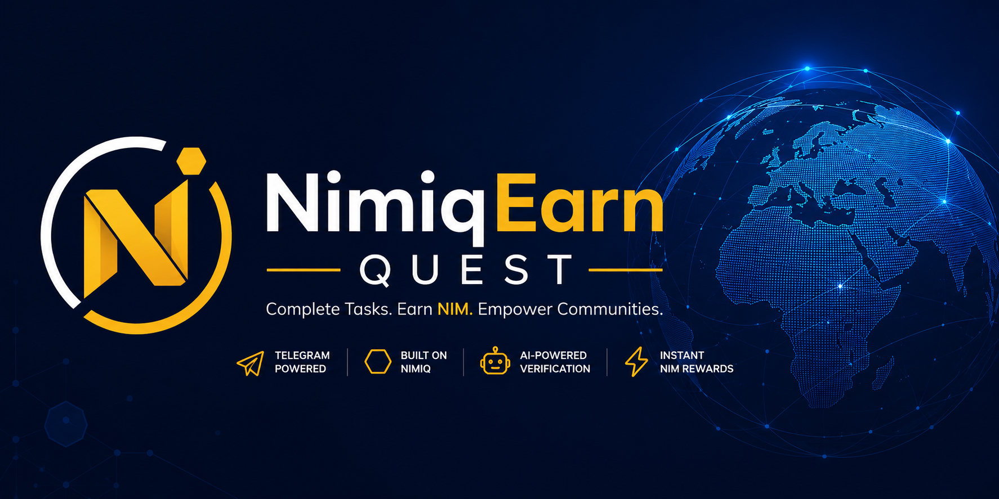

# NimiqEarn Quest

A product concept repository for **NimiqEarn Quest**.

## Overview

NimiqEarn Quest is a Telegram-native task and bounty marketplace where users complete quests and receive NIM rewards. The concept is designed around mobile-first access, fast payouts, simple participation, and structured creator campaigns.

## Main Document

The primary concept and product-flow document is here:

- [docs/nimiqearn-prototype-document.md](docs/nimiqearn-prototype-document.md)

## What This Repository Contains

- product overview and problem framing
- worker and creator personas
- user journey flows
- bot command structure
- screen blueprints
- feature prioritization tables
- architecture, data model, and lifecycle diagrams
- verification, payout, and anti-fraud design

## Notes

This repository is intentionally focused on the product idea, system behavior, and user flow. It is not meant to duplicate a forum proposal post.
