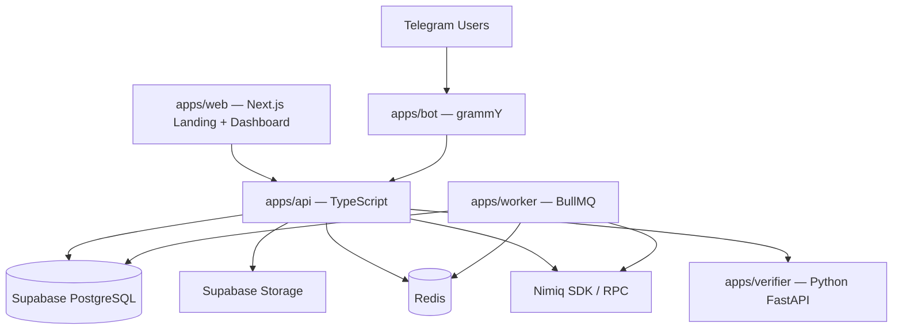
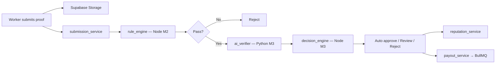

# NimiqEarn Quest — Full Stack (M1–M3)

Official technology stack for building NimiqEarn Quest across all three milestones. This document is the source of truth for architecture decisions.

**Related:** [MILESTONE-1.md](MILESTONE-1.md) · [Product Concept](docs/nimiqearn-prototype-document.md) · [Verification Architecture](docs/nimiqearn-verification-architecture.md)

---

## 1. Stack Overview



| Layer | Technology | Milestones |
| --- | --- | --- |
| **Runtime (main product)** | **Node.js 20+** + TypeScript | M1–M3 |
| Landing + admin web | **Next.js 15** + Tailwind + admin dashboard | M1 (landing) · M2+ (admin) |
| Telegram bot | **TypeScript** + grammY | M1–M3 |
| Backend API | **TypeScript** + **Fastify** + Zod + Prisma | M1–M3 |
| Database | **Supabase PostgreSQL** + **Prisma** | M1–M3 |
| File storage | **Supabase Storage only** | M2–M3 |
| Cache / sessions / queues | **Redis** + **BullMQ** | M1–M3 |
| Nimiq integration | **`@nimiq/core`** + Nimiq RPC/SDK | M1 (validation) · M2+ (payouts) |
| AI verification API | **Python FastAPI** + uvicorn | M3 |
| Monorepo | **pnpm workspaces** | M1–M3 |
| CI/CD | **GitHub Actions** | M1–M3 |
| Deploy | **Vercel** (web) · **Railway / Fly.io / VPS** (bot, API, worker) | M1–M3 |

---

## 2. Languages & Runtimes

### Bot + API = TypeScript (Node.js)

The **Telegram bot** and **backend API** are written in **TypeScript** on Node.js 20+. That is the core stack — not a specific HTTP library name.

| App | Language | Main libraries |
| --- | --- | --- |
| `apps/bot` | **TypeScript** | grammY, `@grammyjs/conversations`, `@grammyjs/storage-redis` |
| `apps/api` | **TypeScript** | Zod, Prisma, `@supabase/supabase-js` |
| `apps/worker` | **TypeScript** | BullMQ, Nimiq SDK |
| `apps/web` | **TypeScript** | Next.js, Tailwind |
| `apps/verifier` | **Python** | FastAPI, uvicorn (M3 only — AI model API) |

### What is faster than Express? (HTTP layer for `apps/api`)

TypeScript/Node still needs an HTTP server for REST routes and Telegram webhooks. **Express is not used.**

If you need something **faster than Express**, these are the main options:

| Framework | vs Express | Notes |
| --- | --- | --- |
| **[Fastify](https://fastify.dev)** | ~2–3× faster | Best default for Node APIs — schema validation, TS support, webhook plugins |
| **[Hono](https://hono.dev)** | Very fast | Lightweight, great TypeScript DX, works on Node and edge |
| **Koa** | Moderate | Cleaner middleware than Express, not a big speed jump |
| **Express** | Baseline | Slower, widely used but not chosen for this project |

**Recommendation:** use **Fastify** as the HTTP server inside the TypeScript API — it is the most common “faster than Express” choice for production Node backends. The bot itself does not use Express or Fastify directly; it uses **grammY** and talks to the TypeScript API.

> **Fastify ≠ FastAPI:** Fastify is Node.js (TypeScript API). **FastAPI** is Python (AI verifier in M3). Similar names, different languages.

---

## 3. Node.js vs Python

| Service | Language | Role |
| --- | --- | --- |
| `apps/bot` | **TypeScript** | Telegram UX — grammY |
| `apps/api` | **TypeScript** | Business logic, webhooks, Supabase |
| `apps/worker` | **TypeScript** | Payout queue |
| `apps/web` | **TypeScript** | Landing + dashboard |
| `apps/verifier` | **Python** | AI model API only (M3) — FastAPI |

---

## 4. Why This Stack

| Choice | Reason |
| --- | --- |
| **TypeScript (bot + API)** | One language across bot, API, worker, and web; shared types in monorepo |
| **grammY** | TypeScript-first Telegram framework; conversations for multi-step flows |
| **Fastify** (HTTP inside API) | Faster than Express; validation + webhooks — not a replacement for TypeScript |
| **FastAPI** (Python verifier) | Fast Python HTTP layer for OCR/NLP endpoints in M3 |
| **Supabase PostgreSQL** | Managed Postgres, Prisma-compatible |
| **Supabase Storage** | All file uploads — no S3 or other object storage |
| **Next.js landing** | SEO, marketing site, grows into dashboard |
| **Redis** | Bot sessions, rate limits, BullMQ payout jobs |
| **pnpm monorepo** | Shared packages; public GitHub for council visibility |

---

## 5. Applications

### 5.1 `apps/web` — Landing + Admin Dashboard

**Tech:** TypeScript · Next.js 15 · Tailwind CSS · shadcn/ui

| Area | Route (example) | Who | Milestone |
| --- | --- | --- | --- |
| **Landing page** | `/` | Public | M1 |
| **Admin dashboard** | `/admin` | Admins only | M2 (core) · M3 (full) |
| **Creator panel** | `/creator` | Creators (optional web mirror of bot) | M2+ |

**Landing page (M1):** hero, how it works, worker/creator sections, Telegram CTA, footer.

**Admin dashboard — manage everything:**

| Section | Capabilities |
| --- | --- |
| Overview | Users, wallets, quests, submissions, NIM paid, pending reviews |
| Users | List, search, suspend, promote to creator, view reputation |
| Wallets | Linked addresses, audit log |
| Quests | All quests, force close, flag suspicious listings |
| Submissions | Review queue, approve/reject, view proof (Supabase Storage) |
| Payouts | Payout log, tx hashes, failed/retry queue |
| Moderation | Flagged users, duplicate clusters, manual override (M3) |
| Settings | Platform wallet balance, rate limits (M3) |

**Auth:** Supabase Auth or admin API-key session — admin role required for `/admin/*`. Creators see only their own quests/submissions.

**Deploy:** Vercel

---

### 5.2 `apps/bot` — TypeScript

**Tech:** TypeScript · grammY · `@grammyjs/conversations` · `@grammyjs/storage-redis`

| Milestone | Features |
| --- | --- |
| M1 | `/start`, `/wallet`, `/creator`, `/help`, onboarding + quest creation wizards |
| M2 | `/quests` feed, quest detail, proof submission (text, link, file → Supabase Storage) |
| M3 | Submission status, reputation display, payout notifications |

**Runs as:** Long-polling (dev) · Webhook mounted on TypeScript API (production)

---

### 5.3 `apps/api` — TypeScript

**Tech:** TypeScript · Node.js · Zod · Prisma · `@supabase/supabase-js`

**HTTP server (inside this app):** Fastify — chosen because it is faster than Express. Express is not used.

**Responsibilities:**

- Business logic shared by bot and web
- Telegram webhook endpoint
- Supabase Storage signed upload/download URLs
- Submission, verification, and payout orchestration
- Internal endpoints for Python verifier (M3)

---

### 5.4 `apps/worker`

**Tech:** BullMQ on Redis

- Processes approved submissions from queue
- Sends NIM via Nimiq SDK
- Writes `tx_hash` and payout status to Postgres
- Retries failed transactions

---

### 5.5 `apps/verifier` — Python + FastAPI

**Tech:** Python 3.11+ · **FastAPI** · uvicorn

This is the **Python model API** — it uses **FastAPI** (Python), not Fastify (Node.js).

| Capability | Library |
| --- | --- |
| HTTP server | **FastAPI** + uvicorn |
| OCR (screenshots) | EasyOCR or Tesseract |
| Duplicate image detection | `imagehash` |
| Text quality / spam | `sentence-transformers` + optional OpenAI API |

**Example endpoint:**

```
POST /verify
Body: { submission_id, proof_type, text, supabase_file_path }
Response: { confidence, signals, recommendation }
```

Node **Fastify** API (`apps/api`) calls Python **FastAPI** (`apps/verifier`) over internal HTTP. Fastify handles auth, business logic, and payouts; FastAPI handles model inference only.

---

## 6. Shared Packages

```
packages/
├── database/     # Prisma schema, migrations, client (Supabase Postgres)
├── shared/       # Zod schemas, enums, types used by bot + api + web
├── nimiq/        # Address validation, payout helpers
└── verification/ # Rule engine (M2) + decision logic (M3)
```

---

## 7. Supabase Setup

One Supabase project for the full MVP. **All persistence and file storage goes through Supabase — no AWS S3 or external object storage.**

### PostgreSQL

- Prisma connects via `DATABASE_URL` (Supabase connection pooler in production)
- All entities: `User`, `WalletProfile`, `Quest`, `Submission`, `Payout`, `ModerationEvent`

### Storage

| Bucket | Purpose | Access |
| --- | --- | --- |
| `proof-uploads` | Worker screenshot/media proof | Private — signed URLs only |
| `quest-assets` | Creator campaign images (optional) | Public read |
| `web-assets` | Landing page static assets (optional) | Public read |

**Upload flow (M2):**

1. Bot requests signed upload URL from API
2. Worker uploads file directly to Supabase Storage
3. API stores `storage_path` on `Submission` record
4. Verifier fetches file via signed URL for AI checks (M3)

**RLS policies:** Workers can upload to their own path prefix; only API service role reads for moderation.

### Supabase keys (env)

```
SUPABASE_URL=
SUPABASE_ANON_KEY=          # web client (limited)
SUPABASE_SERVICE_ROLE_KEY=  # API only — never expose to client
DATABASE_URL=               # Prisma → Supabase Postgres
```

---

## 8. Redis

| Use | Milestone |
| --- | --- |
| grammY session storage | M1 |
| Rate limiting (wallet updates, submissions) | M1+ |
| BullMQ payout job queue | M2 |
| Duplicate submission cooldowns | M2+ |

Local dev: Redis via Docker Compose. Production: Upstash Redis or managed Redis on same VPS.

---

## 9. Nimiq Integration

| Milestone | Capability | Tool |
| --- | --- | --- |
| M1 | Address format + checksum validation | `@nimiq/core` |
| M2 | Send NIM payouts, confirm tx | Nimiq SDK + RPC node |
| M2 | Deterministic tx hash verification | Nimiq RPC lookup |
| M3 | On-chain proof quests | Same RPC layer |

Platform hot wallet (env secret) funds micro-rewards; all payouts logged in `Payout` table with `tx_hash`.

---

## 10. Verification Pipeline (M2 → M3)



| Layer | Runtime | Milestone |
| --- | --- | --- |
| Rule engine | Node | M2 |
| AI verifier | Python FastAPI | M3 |
| Decision + reputation | Node | M3 |
| Payout | Node worker | M2 |

---

## 11. Monorepo Layout

```
NimiqEarn-Quest/
├── apps/
│   ├── web/              # Next.js — landing page (M1) + dashboard (M2+)
│   ├── bot/              # grammY Telegram bot
│   ├── api/              # Fastify backend
│   ├── worker/           # BullMQ payout processor (M2+)
│   └── verifier/         # Python FastAPI AI service (M3)
├── packages/
│   ├── database/         # Prisma + Supabase Postgres
│   ├── shared/           # Shared types and Zod schemas
│   ├── nimiq/            # Nimiq utilities
│   └── verification/     # Rule engine + decision logic
├── supabase/
│   ├── migrations/       # Optional Supabase CLI migrations
│   └── seed.sql
├── docs/
├── docker-compose.yml    # Redis + local services
├── pnpm-workspace.yaml
├── STACK.md              # This document
├── MILESTONE-1.md
└── README.md
```

---

## 12. Stack by Milestone

### Milestone 1 — Core MVP Infrastructure

| Build | Stack |
| --- | --- |
| Landing page (marketing) | Next.js + Tailwind → Vercel |
| Telegram bot | grammY + conversations + Redis sessions |
| API | Fastify + Prisma + Supabase Postgres |
| Wallet onboarding | `@nimiq/core` validation |
| Quest creation | Bot wizard → API → Postgres |
| Storage | Supabase project created; buckets configured; uploads deferred to M2 |
| Stubs | `payout_service`, `verification_service`, `submission_service` |

### Milestone 2 — Marketplace & Payments

| Build | Stack |
| --- | --- |
| Quest discovery + join | grammY + API |
| Proof submission | Text/link in Postgres · files → **Supabase Storage** |
| Payout engine | BullMQ worker + Nimiq SDK |
| Deterministic verification | Node `rule_engine` in `packages/verification` |
| Web admin dashboard | Next.js `/admin` — users, quests, submissions, payouts, moderation |

### Milestone 3 — Verification & Launch

| Build | Stack |
| --- | --- |
| AI verification | Python FastAPI — OCR, duplicates, NLP |
| Confidence routing | Node `decision_engine` |
| Reputation system | Postgres score updates |
| Anti-spam | Redis rate limits + reputation gating |
| Public beta | Landing page update + bot open access |
| Analytics | Postgres counts surfaced on web dashboard |

---

## 13. Deployment

| Service | Platform |
| --- | --- |
| `apps/web` | **Vercel** |
| Supabase | **Supabase Cloud** (Postgres + Storage) |
| `apps/bot` + `apps/api` + `apps/worker` | **Railway**, **Fly.io**, or **VPS** (Docker) |
| `apps/verifier` | Same VPS/Railway as API (M3) |
| Redis | Upstash or co-located with API |
| CI | GitHub Actions — lint, test, typecheck on every push |

---

## 14. Environment Variables (summary)

```bash
# Telegram
BOT_TOKEN=
WEBHOOK_URL=
WEBHOOK_SECRET=

# Supabase
SUPABASE_URL=
SUPABASE_ANON_KEY=
SUPABASE_SERVICE_ROLE_KEY=
DATABASE_URL=

# Redis
REDIS_URL=

# Nimiq
NIMIQ_NETWORK=mainnet|testnet
NIMIQ_RPC_URL=
PAYOUT_WALLET_SEED=        # M2+ — server only

# AI Verifier (M3)
VERIFIER_URL=
OPENAI_API_KEY=            # optional

# Web
NEXT_PUBLIC_BOT_URL=https://t.me/YourBot
NEXT_PUBLIC_API_URL=
```

---

## 15. What We Are Not Using

| Avoided | Why |
| --- | --- |
| **Express** | Fastify is faster and better suited for new TypeScript APIs |
| **AWS S3 / Cloudflare R2 / MinIO** | Supabase Storage only — one platform for DB + files |
| **Telegraf** | grammY is more actively maintained for new TypeScript projects |
| **Separate Postgres host** | Supabase Postgres reduces ops overhead for MVP |
| **Fastify for Python** | Fastify is Node-only; Python AI API uses **FastAPI** |
| **Kubernetes** | Overkill for 6-week MVP |
| **GraphQL** | REST is sufficient for bot + web + internal verifier calls |

---

*This stack supports the full approved proposal: Telegram-native marketplace, Supabase-backed storage, Nimiq payouts, Python AI verification, and a public landing page for ecosystem visibility.*
