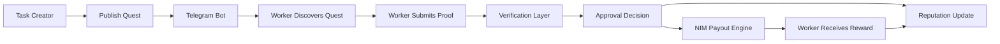
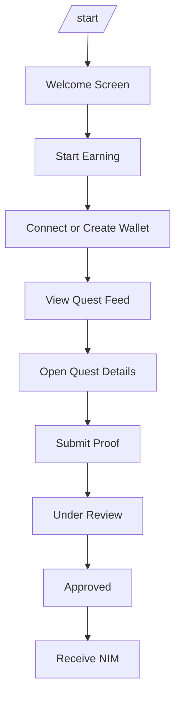
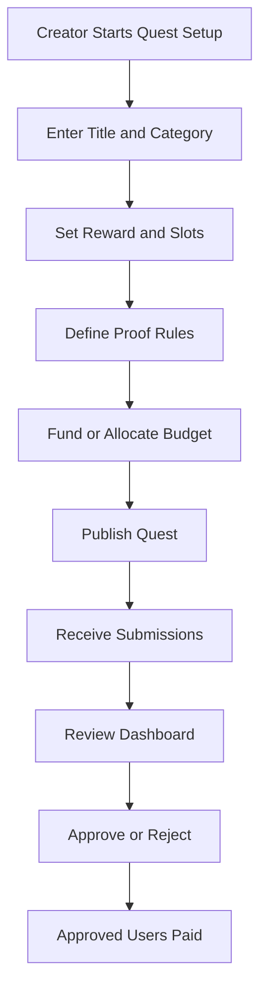
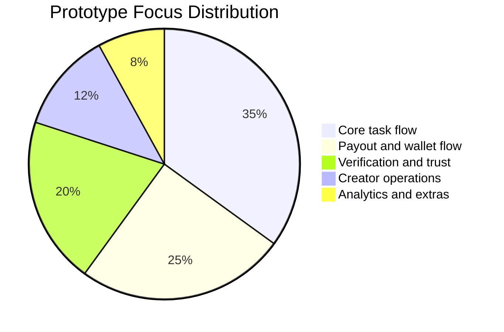
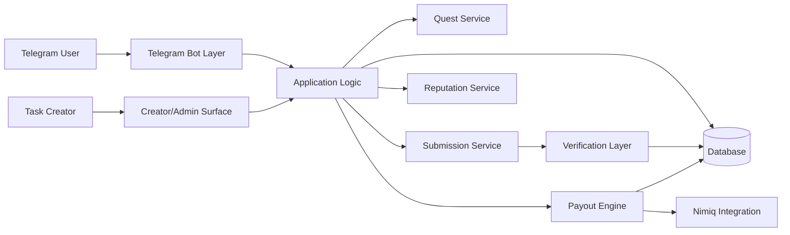
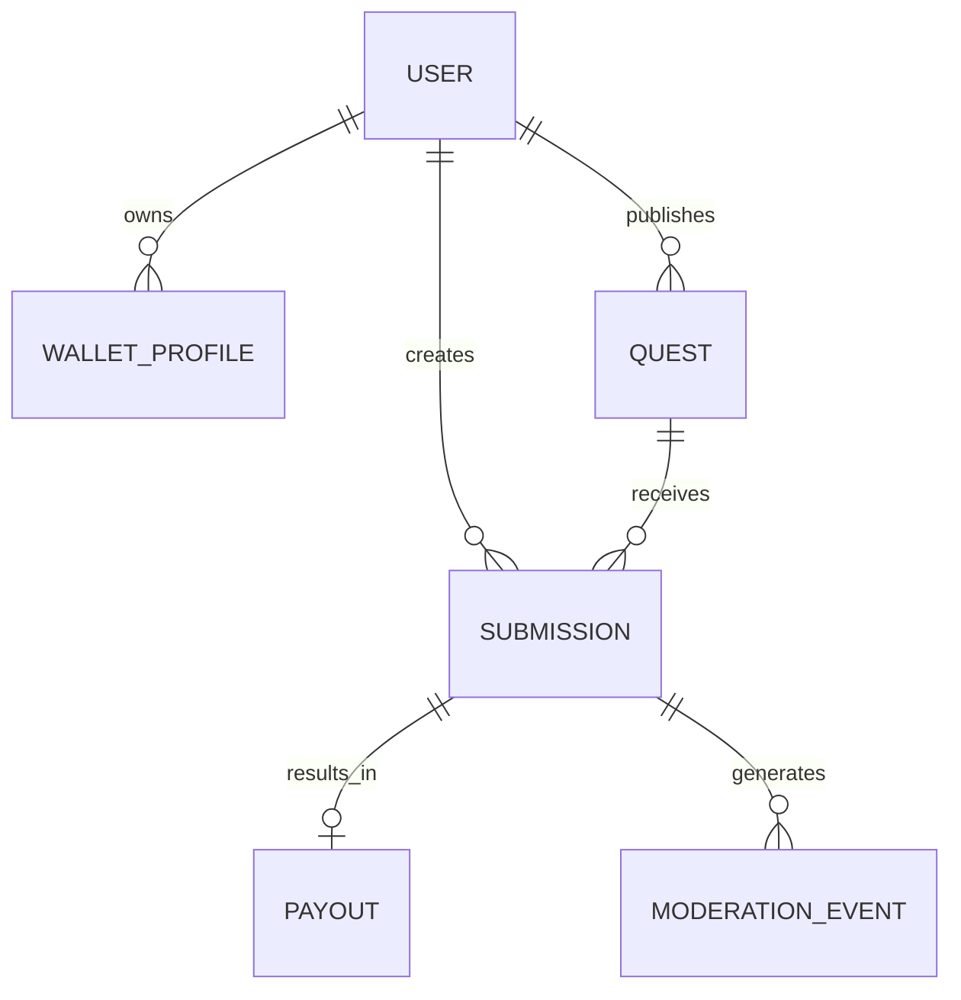
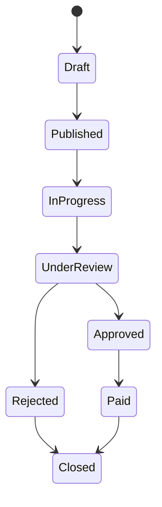
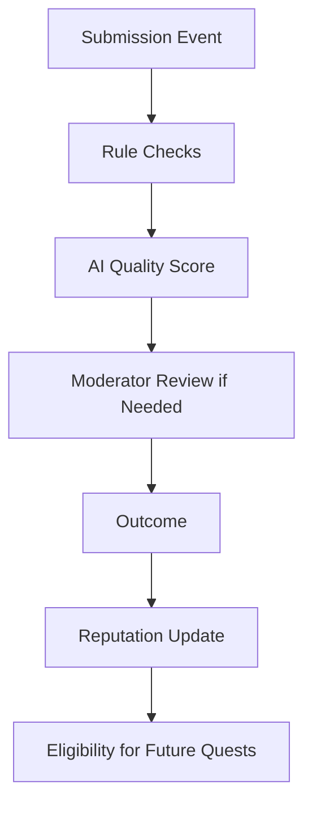
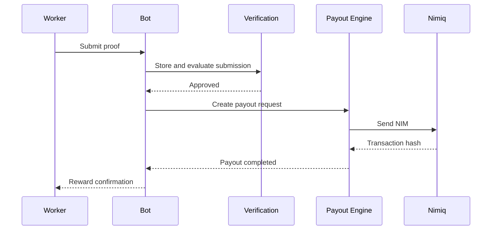
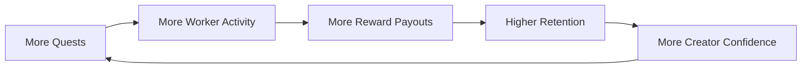

# NimiqEarn Quest Product Concept

## Executive Summary

NimiqEarn Quest is a Telegram-native task and bounty marketplace where users complete quests and receive rewards in NIM. The concept is designed for mobile-first participation, low-friction onboarding, fast payouts, and repeatable community engagement.

The product sits at the intersection of:

- microtask marketplaces
- community incentive systems
- Telegram-native user flows
- Nimiq-powered digital payments
- AI-assisted verification and moderation

Its core product promise is simple:

**discover tasks, submit proof, get verified, receive NIM**

## 1. Product Overview

### Product Name

NimiqEarn Quest

### Product Type

AI-powered Telegram task and bounty marketplace powered by NIM payouts.

### Product Positioning

NimiqEarn Quest is intended to serve as a lightweight earning and participation layer for communities, startups, ecosystem teams, and mobile-first users. Instead of forcing users through a traditional web platform with multiple complex steps, the product uses Telegram as the primary interface and NIM as the reward rail.

### Core Idea

Task creators publish quests. Workers complete those quests. The system verifies proof, approves valid submissions, and processes payouts in NIM. Over time, reputation and moderation systems help improve trust, reduce abuse, and surface higher-quality work.

## 2. Problem Statement

Two clear product problems exist.

### Problem A: Simple Online Earnings Are Still Friction-Heavy

Many users want access to flexible online work, but common platforms have several weaknesses:

- they are too complex for mobile-first users
- they often assume desktop usage
- onboarding may depend on formal banking or lengthy verification
- payout speed is often poor
- they are not optimized for small community-driven tasks

### Problem B: Communities Need Better Incentive Infrastructure

Web3 projects, DAOs, startups, and digital communities need lightweight systems to:

- distribute micro-bounties
- reward community participation
- onboard and activate users
- collect product feedback
- run social or referral campaigns
- pay contributors without manual coordination overhead

Many available tools solve only part of this flow. NimiqEarn Quest combines the flow into one product.

## 3. Proposed Solution

NimiqEarn Quest combines:

- Telegram bot infrastructure
- task marketplace logic
- wallet and payout routing
- AI-assisted verification
- reputation and anti-abuse systems

The result is a simple operating loop:

1. Creator posts a quest.
2. Worker discovers and completes it.
3. Worker submits proof.
4. The system reviews the submission.
5. Valid submissions are paid in NIM.

## 4. Product Vision

The long-term vision is to make Telegram a practical participation and earning channel for Nimiq-powered communities.

In that model:

- every campaign can become a structured quest
- every accepted contribution can become a measurable payout event
- every new participant can encounter Nimiq through utility rather than speculation

NimiqEarn Quest is not meant to be just a bounty board. It is intended to become an engagement engine with clear workflows and payout trust.

## 5. Product Principles

The concept is guided by these principles:

| Principle | Meaning in Product Terms |
| --- | --- |
| Mobile-first | Core actions should work comfortably inside Telegram on a phone |
| Low-friction | Onboarding, task discovery, and proof submission should require minimal steps |
| Fast rewards | Users should understand exactly how and when rewards are processed |
| Transparent trust | Verification status, payout state, and moderation outcomes should be visible |
| Creator simplicity | Task setup should be clear enough for non-technical operators |
| Abuse resistance | Reputation, limits, and verification should make reward farming harder |

## 6. Target Users

### Worker Personas

| Persona | Needs | Example Use |
| --- | --- | --- |
| Student | simple mobile-first tasks | completes feedback or campaign quests |
| Freelancer | quick side income | joins paid microtasks between larger jobs |
| Creator | campaign participation rewards | submits content or promotion proof |
| Developer | bounty opportunities | completes bug, integration, or testing quests |
| Community member | incentive-based participation | engages in challenges, referrals, or support tasks |

### Creator Personas

| Persona | Needs | Example Use |
| --- | --- | --- |
| Startup | user acquisition and testing | launches onboarding and feedback quests |
| DAO | contribution incentives | pays members for community actions |
| Ecosystem team | activation campaigns | rewards wallet use, testing, or education tasks |
| Marketing team | measurable engagement | runs social and referral quests |
| Product team | structured feedback | pays users for beta testing and reports |

## 7. Primary Use Cases

NimiqEarn Quest is suited to the following quest categories:

| Category | Description | Proof Type |
| --- | --- | --- |
| Product testing | test a feature and submit feedback | text, screenshot, link |
| Social campaign | complete an awareness task | URL, username, screenshot |
| Community engagement | join or participate in a community action | username, screenshot |
| Referral quest | invite or onboard new users | referral reference, completion event |
| Bug bounty | report issues or edge cases | text, screenshot, reproduction steps |
| Content quest | create a post, graphic, or short video | link, file, text |
| Survey quest | answer structured feedback questions | form response, text |
| Research quest | gather targeted data or audit actions | link, screenshot, notes |

## 8. Value Flow

## 9. User Experience

### Worker Journey

1. User opens the bot.
2. User starts onboarding.
3. User creates or links a payout wallet.
4. User browses quests.
5. User selects a quest and reads instructions.
6. User submits proof.
7. User tracks review status.
8. Approved submission triggers NIM payout.
9. User reputation updates based on task outcome.

### Creator Journey

1. Creator opens creator flow.
2. Creator creates a quest with instructions, rewards, and proof rules.
3. Creator allocates a payout budget.
4. Quest becomes visible to eligible workers.
5. Workers submit responses.
6. Review and moderation occur.
7. Approved users are paid.
8. Creator monitors performance and completion trends.

## 10. Prototype User Flows

### New Worker Flow

### Worker Status Journey

| Stage | User Sees | System Action |
| --- | --- | --- |
| Joined | welcome message and onboarding options | create user profile |
| Wallet ready | payout-ready state | link payout destination |
| Browsing | quest list and filters | fetch active eligible quests |
| Submitted | pending review state | store proof and run checks |
| Approved | reward confirmation | create payout record |
| Paid | transaction confirmation | log payout completion |

### Creator Quest Flow

## 11. Bot Structure

### Proposed Commands

| Command | Purpose |
| --- | --- |
| `/start` | start onboarding |
| `/quests` | browse available quests |
| `/wallet` | manage payout wallet |
| `/earnings` | view reward history |
| `/reputation` | check trust score |
| `/submit` | continue a pending submission |
| `/creator` | open creator tools |
| `/help` | open support guidance |

### Primary Navigation

| Menu Area | Function |
| --- | --- |
| Start Earning | onboarding and first actions |
| Browse Quests | quest discovery |
| My Tasks | submissions and progress |
| My Earnings | reward history |
| My Wallet | payout settings |
| Invite Friends | referral-oriented growth |
| Creator Dashboard | task creation and review |

## 12. Screen Blueprint

### Worker Home Screen

| Section | Purpose |
| --- | --- |
| available quests | show current opportunities |
| earnings summary | reinforce reward utility |
| pending reviews | reduce uncertainty |
| reputation badge | communicate trust level |
| shortcuts | speed up repeat actions |

### Quest Detail Screen

| Field | Purpose |
| --- | --- |
| quest title | quick context |
| reward amount | motivation and clarity |
| difficulty tag | expectation setting |
| deadline | urgency |
| proof requirements | submission clarity |
| acceptance criteria | trust and fairness |

### Creator Dashboard

| Section | Purpose |
| --- | --- |
| active quests | current campaigns |
| budget status | spend visibility |
| pending submissions | review queue |
| approvals and rejections | quality tracking |
| payout log | operational transparency |

## 13. Core MVP Features

| Feature Area | MVP Capability | Why It Matters |
| --- | --- | --- |
| Telegram bot | user onboarding, commands, messages | native mobile-first access |
| Wallet onboarding | connect or define payout wallet | reward delivery |
| Quest marketplace | list, filter, view, join quests | core discovery experience |
| Submission pipeline | proof capture and status tracking | operational reliability |
| Verification engine | AI checks plus rules | scalable moderation support |
| Payout engine | approve and pay in NIM | utility and trust |
| Reputation system | worker and creator trust signals | abuse reduction |
| Admin tools | moderation and review surface | operator control |

## 14. Feature Prioritization

| Priority | Feature | Notes |
| --- | --- | --- |
| P0 | bot onboarding | first usable product surface |
| P0 | quest browsing | required for participation |
| P0 | proof submission | core action |
| P0 | payout processing | core value promise |
| P1 | AI moderation | improves operational scale |
| P1 | reputation scoring | improves trust quality |
| P1 | creator dashboard | improves campaign management |
| P2 | advanced analytics | useful after initial usage |
| P2 | referrals automation | growth expansion |
| P2 | multilingual support | broader market access |

### Prototype Focus Chart

## 15. Example Quest Templates

| Quest Type | Sample Prompt | Reward Style | Typical Proof |
| --- | --- | --- | --- |
| onboarding quest | create a wallet and complete first action | fixed reward | screenshot, wallet event |
| product feedback | test a feature and share notes | fixed reward | text, screenshot |
| social growth quest | publish or share campaign content | fixed reward per accepted action | link, username |
| bug bounty | identify a reproducible issue | variable reward by severity | text, screenshots, steps |
| referral quest | invite qualified new users | performance-based reward | referral event, completion record |

## 16. System Architecture

### Architecture Overview

### Layer Breakdown

| Layer | Responsibility |
| --- | --- |
| Telegram interaction layer | command handling, message routing, session state |
| application layer | user logic, quest logic, approvals, creator operations |
| verification layer | AI checks, duplicate detection, moderation support |
| payment layer | payout queuing, transaction logging, reward accounting |
| data layer | persistent records for users, quests, submissions, payouts |

## 17. Data Model

### Suggested Entities

| Entity | Key Fields | Purpose |
| --- | --- | --- |
| User | `user_id`, `telegram_id`, `role`, `reputation_score` | worker or creator identity |
| WalletProfile | `wallet_id`, `user_id`, `nimiq_address`, `status` | payout routing |
| Quest | `quest_id`, `creator_id`, `reward_amount`, `status`, `deadline` | task definition |
| Submission | `submission_id`, `quest_id`, `user_id`, `status`, `ai_score` | proof record |
| Payout | `payout_id`, `submission_id`, `amount`, `tx_hash`, `payout_status` | reward transfer |
| ModerationEvent | `event_id`, `submission_id`, `flag_type`, `resolution` | trust and review history |

### Conceptual Entity Relationships

## 18. Quest Lifecycle

### Lifecycle Table

| Status | Meaning |
| --- | --- |
| Draft | creator is still configuring the quest |
| Published | visible to workers |
| In Progress | at least one worker is participating |
| Under Review | proof has been submitted |
| Approved | submission accepted |
| Rejected | submission failed checks or criteria |
| Paid | payout completed |
| Closed | quest finished or archived |

## 19. Verification Approach

Verification quality is central to platform trust. The proposed approach blends automation and human override.

### Verification Matrix

| Quest Type | Primary Proof | Automated Checks | Manual Fallback |
| --- | --- | --- | --- |
| screenshot quest | image proof | image classification, duplicate detection | moderator check |
| feedback quest | text response | length, uniqueness, semantic relevance | creator review |
| social quest | URL or username | link pattern checks, duplication | manual audit |
| bug report | structured text and screenshot | template validation, similarity checks | technical review |
| referral quest | referral linkage | event confirmation, duplicate rules | support review |

### Review Strategy

- required fields are checked first
- proof payloads are scored for completeness and relevance
- repeat or suspicious patterns are flagged
- uncertain cases are routed for manual review

## 20. Anti-Fraud and Trust Controls

Because the product includes rewards, abuse resistance is essential from the first version.

| Control | Purpose |
| --- | --- |
| rate limits | reduce spam submission bursts |
| duplicate detection | reduce copied or recycled proof |
| reputation gating | limit high-value tasks to trusted users |
| creator review tools | improve campaign quality |
| flagged user queues | surface risky accounts |
| reward caps for new users | reduce farming incentives |
| proof templates | improve submission quality and consistency |

### Trust Signal Model

## 21. Payout Logic

The payout pipeline should be simple, visible, and auditable.

### Payout Status Model

| Status | Meaning |
| --- | --- |
| queued | approved and waiting for processing |
| processing | payout request is being executed |
| paid | transaction completed successfully |
| failed | payout execution failed and needs retry or review |

## 22. Non-Functional Expectations

Even as a prototype, the product should aim for a few core quality standards.

| Area | Expectation |
| --- | --- |
| reliability | submissions and payouts should not be silently lost |
| clarity | users should always know their current task and payout state |
| auditability | review actions and payout events should be traceable |
| moderation safety | suspicious activity should be easy to flag and review |
| extensibility | quest types and proof rules should be adaptable over time |

## 23. Product Value

NimiqEarn Quest creates a practical reward loop rather than a passive listing experience.

### Product Value Areas

| Value Area | Explanation |
| --- | --- |
| wallet utility | gives users a reason to receive and use NIM |
| recurring engagement | quests can create repeat participation loops |
| creator efficiency | communities can run structured reward campaigns |
| mobile accessibility | Telegram lowers interaction friction |
| measurable actions | each quest creates trackable contribution events |

### Conceptual Adoption Flywheel

## 24. Prototype Scope

The first credible prototype should include:

| Included in Prototype | Description |
| --- | --- |
| Telegram bot | command-driven quest interaction |
| worker onboarding | profile and wallet setup |
| creator quest setup | basic task publishing flow |
| quest feed | list and detail views |
| proof submission | text, link, and screenshot support |
| approval flow | review and outcome statuses |
| payout flow | NIM transfer handling |
| moderation support | trust and anti-abuse checks |

## 25. Example Operational Metrics

These are product-facing metrics the system should be able to track once implemented.

| Metric | Why It Matters |
| --- | --- |
| quests published | supply-side activity |
| quests completed | user execution health |
| approval rate | quality of submissions |
| payout completion time | trust and operations quality |
| repeat worker participation | retention signal |
| repeat creator usage | campaign satisfaction |
| flagged submissions | abuse monitoring |
| total NIM paid | reward utility volume |

## 26. Risks and Mitigation

| Risk | Why It Matters | Mitigation |
| --- | --- | --- |
| spam submissions | can destroy creator trust | AI filtering, rate limits, reputation gating |
| low-quality quests | can reduce worker retention | templates, creator controls, moderation |
| payout disputes | can reduce trust in rewards | audit logs, status visibility, review notes |
| onboarding drop-off | can reduce conversion | Telegram-first design, fewer steps, guided wallet setup |
| task fraud rings | can drain reward budgets | duplicate detection, reward caps, review queues |

## 27. Future Expansion

After concept validation, future versions could extend into:

- richer creator analytics
- referral campaign automation
- multilingual onboarding
- advanced fraud scoring
- campaign templates by task type
- partner API access
- mini-app interface expansion
- more advanced reputation tiers

## 28. Conclusion

NimiqEarn Quest is a focused product concept for turning Telegram into a Nimiq-powered task and reward environment. Its strength is the simplicity of the loop: creators launch quests, users complete them, proof is verified, and rewards are paid in NIM.

That makes the concept both easy to understand and operationally meaningful. It offers a clear path toward wallet utility, repeat engagement, and measurable community incentive flows in a format that feels accessible to mainstream mobile users.
