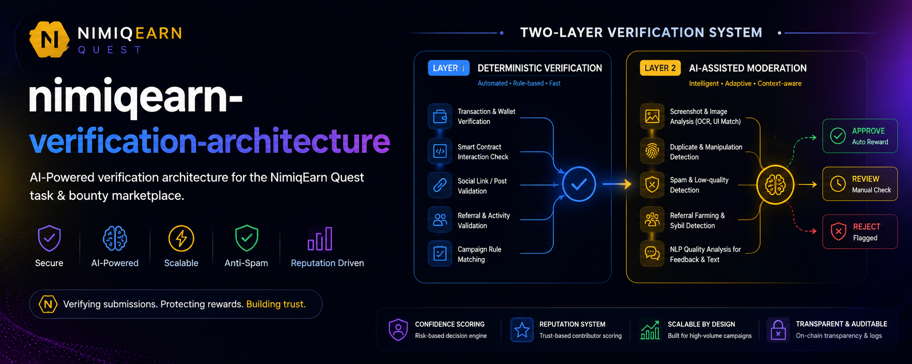
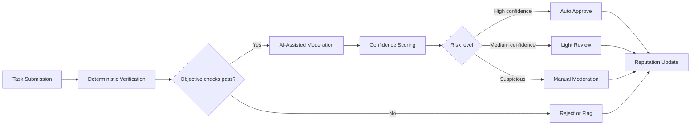

# NimiqEarn Quest Verification Architecture

## Overview

The NimiqEarn Quest verification system is designed as a hybrid validation pipeline that combines deterministic checks, AI-assisted moderation, and contributor reputation scoring. The goal is to verify task submissions accurately while keeping moderation scalable, reducing fraud, and protecting reward integrity across high-volume campaigns.

This architecture is intentionally layered. Objective proofs are handled by rule-based validation first, while subjective, abuse-prone, or noisy submissions are escalated into an AI-assisted moderation path. The final decision can be fully automatic, lightly reviewed, or manually escalated depending on the confidence score and risk profile of the submission.

## Design Goals

- verify submissions quickly without creating a heavy manual workload
- support many campaign types with different proof requirements
- reduce spam, fake engagement, recycled content, and reward farming
- preserve payout integrity through transparent and auditable decision paths
- reward trustworthy contributors with smoother approvals over time
- keep moderation capacity focused on the highest-risk cases

## Supported Proof Formats

The verification layer should accept multiple proof types depending on the quest or campaign design:

- transaction hashes
- wallet interactions
- screenshots
- social links and posts
- referral activity
- text-based feedback
- uploaded media

Not every campaign needs every proof type. The verification engine should adapt to the task definition and only evaluate the proof formats required for that specific campaign.

### Proof Format Examples

| Proof Format | Example Submission | What the System Verifies |
| --- | --- | --- |
| transaction hash | `0x9f3a...a21c` from a token transfer | transaction exists, belongs to the correct wallet, happened on the correct chain, and matches the campaign target |
| wallet interaction | wallet connected and signed a contract call | interaction occurred with the expected contract and function, within the valid time window |
| screenshot | screenshot of a completed signup or dashboard state | visible UI matches the expected result, text is not edited, and the screenshot is not reused |
| social link/post | a public X or Facebook post URL | the post exists, is public if required, includes required tags or mentions, and is still accessible |
| referral activity | invited user completed onboarding and first action | referral relationship is valid, the referred account is unique, and completion rules are satisfied |
| text-based feedback | written feedback about a product test | response is relevant, not copied, not empty, and meets minimum quality requirements |
| uploaded media | short video or image proof of participation | file is authentic, relevant, not duplicated, and consistent with the task request |

### Example Campaign Pairing

- a blockchain quest may require a transaction hash plus a wallet address
- a social quest may require a public post URL plus a screenshot
- a referral quest may require referral linkage plus an activity confirmation record
- a feedback quest may require a text response plus optional uploaded media

This pairing matters because it prevents the system from over-verifying tasks that only need one strong proof signal, while still allowing higher-risk campaigns to demand multiple evidence types.

## Verification Pipeline

The system follows a two-layer verification flow:

1. A submission is received with its proof payload and campaign context.
2. Deterministic rules validate objective conditions first.
3. If the submission passes the rule-based layer, the AI moderation layer evaluates quality, integrity, and abuse signals.
4. A confidence score is produced from the combined signals.
5. The submission is routed to one of three outcomes:
   - auto approve
   - lightweight review
   - manual moderation or rejection
6. The final outcome updates contributor reputation and future eligibility.

### Verification Flow Diagram

## Layer 1: Deterministic Verification

The first layer is responsible for objective, rule-based validation. It should be fast, predictable, and easy to audit.

### Core Responsibilities

- confirm that a required event actually happened
- match proof data against campaign rules
- detect invalid, missing, or malformed submissions
- eliminate obvious fraud before any AI moderation is needed

### Typical Checks

- onchain tasks:
  - validate transaction hashes
  - verify wallet interaction with the expected contract or address
  - confirm the correct network and event type
- social tasks:
  - check whether the post or link exists
  - verify required hashtags, mentions, or content patterns
  - confirm minimum engagement or timing rules when applicable
- referral tasks:
  - validate successful onboarding
  - confirm that the referred account completed the required action
  - check for duplicate or self-referral behavior
- campaign rules:
  - ensure deadlines are respected
  - confirm format compliance
  - reject submissions missing required fields

This layer should act as the first filter. If a submission fails deterministic verification, there is usually no need to spend moderation resources on it unless a campaign defines an exception path.

### Deterministic Verification Examples

#### Example 1: Onchain task

Campaign requirement:

- send at least 10 NIM to a designated address
- use the correct wallet
- complete the transaction before the deadline

Submission example:

- wallet address: `NQ12...`
- transaction hash: `0xabc123...`
- timestamp: within the campaign window

What happens:

- the system checks that the hash is valid and on the expected chain
- the recipient address matches the campaign address
- the amount is at or above the minimum required amount
- the timestamp falls before the cutoff

Outcome:

- if all checks pass, the submission moves to AI moderation only if extra risk scoring is needed
- if any core rule fails, the submission is rejected or flagged immediately

#### Example 2: Social post task

Campaign requirement:

- publish a public post
- mention the campaign hashtag
- include a required link

Submission example:

- post URL: `https://social.example/post/123`
- caption: includes the campaign tag and link

What happens:

- the system checks that the post exists
- the post is public and accessible
- the caption contains the required hashtag or mention
- the content has not been deleted or edited in a way that breaks the task rules

Outcome:

- a valid post proceeds to quality review if necessary
- a missing tag or inaccessible post is rejected

#### Example 3: Referral task

Campaign requirement:

- invite a new user
- the new user must register and complete their first activity

Submission example:

- referrer: user `A`
- referred user: user `B`
- referred user completed onboarding and one quest

What happens:

- the system confirms the referral relationship
- it checks that user `B` is unique and not a duplicate account
- it verifies that user `B` completed the required activity

Outcome:

- if the referred account is real and active, the reward can be approved
- if the account is new but inactive, the submission may remain under review
- if the account appears to be part of a farming cluster, it is flagged

## Layer 2: AI-Assisted Moderation

The second layer handles submissions that are technically valid but still need deeper quality or risk evaluation. This layer is especially important for image-heavy, text-heavy, and abuse-prone tasks.

### Core Responsibilities

- assess screenshots for authenticity and relevance
- identify duplicate or manipulated content
- filter spam, low-effort, or low-quality responses
- evaluate freeform text for usefulness and semantic fit
- detect behavioral patterns associated with Sybil activity or farming

### AI Capabilities

- OCR and image analysis:
  - extract text from screenshots
  - compare UI elements with expected screens
  - detect obvious edits, overlays, or tampering
- duplicate and manipulation detection:
  - identify reused screenshots
  - detect repeated media across multiple accounts
  - spot copied text or recycled proof
- spam and quality filtering:
  - detect generic, empty, or templated responses
  - score submissions for effort and relevance
  - surface low-signal submissions for review
- NLP analysis:
  - evaluate the clarity and relevance of feedback
  - detect nonsensical, AI-generated, or off-topic responses
  - identify repeated phrasing across many submissions
- behavioral analysis:
  - compare timing, device, and submission patterns
  - detect batch activity that suggests farming
  - flag suspicious referral or participation clusters

The AI layer should not be treated as an absolute judge. It is a risk engine that helps route submissions into the correct outcome path with higher confidence and less manual overhead.

### AI Moderation Examples

#### Example 1: Screenshot validation

Submission:

- a user uploads a screenshot showing a completed dashboard action

AI checks:

- OCR extracts the visible text
- the UI layout is compared with the expected screen
- the system looks for signs of cropping, overlays, or re-encoding artifacts

Possible result:

- high confidence if the screenshot matches the expected UI and looks authentic
- low confidence if the image has repeated artifacts, mismatched text, or signs of editing

#### Example 2: Feedback quality review

Submission:

- a user writes "nice app, good project" for a product feedback quest

AI checks:

- length and specificity
- semantic relevance to the product
- repetition against other submissions

Possible result:

- low quality if the text is too generic to be useful
- medium confidence if the text is relevant but brief
- high confidence if the response contains specific, original feedback

#### Example 3: Duplicate detection

Submission:

- the same screenshot is uploaded by multiple accounts

AI checks:

- perceptual similarity across images
- account relationship patterns
- time clustering of uploads

Possible result:

- the repeated proof is flagged as suspicious
- if many accounts behave similarly, the system can escalate the whole cluster for review

## Confidence Scoring

The architecture depends on confidence scoring as the decision bridge between automation and human moderation.

### Example Confidence Routing

| Example Submission | Rule Checks | AI Result | Confidence | Final Route |
| --- | --- | --- | --- | --- |
| valid wallet transaction from a trusted user | pass | clean image or text context | high | auto approve |
| screenshot looks real but OCR is slightly noisy | pass | mostly consistent | medium | light review |
| post exists but the content appears copied | pass | duplication risk | low | manual review |
| referral is technically valid but account behavior looks clustered | pass | suspicious behavior pattern | low | manual review or reject |

### Why Confidence Matters

Confidence scoring prevents the system from treating every submission the same way. A clean, long-time contributor should not wait behind the same queue as a suspicious batch of low-quality or potentially fraudulent submissions. At the same time, a borderline case should not be auto approved just because it passed the first layer.

### Score Bands

- high confidence:
  - submission appears valid
  - proof is consistent with campaign rules
  - no strong abuse indicators are present
  - can be auto approved
- medium confidence:
  - submission is likely valid but not fully certain
  - small inconsistencies or weak signals exist
  - can enter lightweight review
- low confidence:
  - submission contains suspicious, incomplete, or manipulated signals
  - should be flagged for manual moderation

### Scoring Inputs

The confidence engine can combine signals such as:

- deterministic pass/fail results
- OCR accuracy and visual consistency
- duplication probability
- textual relevance and quality
- similarity to prior submissions
- account age and historical behavior
- referral graph anomalies
- contributor reputation

The exact weighting can evolve over time, but the principle stays the same: the more trustworthy and consistent the evidence, the less human intervention is required.

## Reputation System

Contributor reputation is a long-term trust signal that improves verification efficiency.

### Purpose

- identify contributors with a history of good submissions
- reduce friction for trusted users
- prioritize moderation for risky or new accounts
- improve approval speed without weakening controls

### Reputation Signals

- submission acceptance rate
- number of rejected or flagged submissions
- repeated policy violations
- history of duplicate or manipulated proofs
- consistency across different campaign types
- account longevity and activity patterns

### Reputation Effects

- trusted contributors may receive faster approvals
- low-risk users can move through lighter verification paths
- suspicious accounts can face stricter review rules
- high-value campaigns can require a minimum reputation threshold

Reputation should be additive over time, but it should also be able to decrease when behavior changes. Trust must remain earned, not permanent.

### Reputation Example

Imagine two users submit the same kind of screenshot-based task:

- user `A` has 25 accepted submissions, 0 rejections, and consistent participation over several weeks
- user `B` has 2 accepted submissions, 5 rejected submissions, and several duplicate proof flags

The same screenshot from user `A` may receive faster approval because the reputation signal supports the submission. The screenshot from user `B` may be routed to manual review because historical behavior increases risk even if the current proof looks acceptable.

This does not mean reputation overrides proof quality. It simply changes how much uncertainty the system is willing to tolerate.

## Decision Outcomes

The final verification outcome should map cleanly into platform actions.

| Outcome | Meaning | Typical Action |
| --- | --- | --- |
| Auto Approve | submission is highly trusted and passes all checks | release reward automatically |
| Light Review | submission is likely valid but not fully certain | queue for quick human confirmation |
| Manual Review | submission is suspicious or ambiguous | moderator inspection required |
| Reject | submission fails validation or shows clear abuse | deny reward and log reason |

This decision model keeps the system flexible. It allows the platform to scale while still reserving human time for edge cases.

### Outcome Examples

- auto approve:
  - a transaction hash matches the campaign target, the wallet is correct, and the contributor has a strong trust history
- light review:
  - a screenshot is valid but OCR confidence is slightly low because of compression or image quality
- manual review:
  - a social post exists, but engagement looks suspicious or the account behavior appears clustered
- reject:
  - the proof is missing, duplicated, manipulated, or clearly outside the campaign rules

## Anti-Fraud Coverage

The architecture is designed to reduce the most common fraud patterns in reward marketplaces.

### Risks Addressed

- spam submissions
- fake engagement
- duplicate proof reuse
- edited or manipulated screenshots
- low-effort copied text
- referral farming
- Sybil account clusters
- reward abuse across multiple campaigns

### Defensive Measures

- deterministic validation before AI review
- duplicate detection across submissions
- content authenticity checks
- risk scoring for new or unstable accounts
- reputation-based access control for sensitive campaigns
- manual escalation for suspicious clusters

### Anti-Fraud Example Scenarios

#### Example 1: Recycled screenshot farming

Two hundred accounts upload the same image of a successful app install screen. The deterministic layer cannot prove fraud by itself because the image format is valid, but the AI layer detects strong similarity across the batch. The system flags the cluster for manual moderation and prevents automatic payouts.

#### Example 2: Fake social engagement

A user submits a post URL that exists, but the caption is a copied template used by many other accounts. The deterministic layer passes the post existence check, but the AI layer identifies duplicate phrasing and low originality. The submission moves to review instead of auto approval.

#### Example 3: Referral abuse

One account refers many newly created wallets or social accounts that never complete real activity. Behavioral analysis sees a suspicious pattern of rapid signups, shared metadata, and repeated timing. The system lowers confidence and can block the rewards until a human confirms legitimacy.

## Operational Notes

To keep the verification system practical, the implementation should follow a few operational principles:

- keep rule-based checks fast and deterministic
- make AI moderation explainable enough for moderators to trust the result
- log why a submission was approved, reviewed, rejected, or flagged
- store moderation decisions for later auditing and tuning
- allow campaign-specific rules to override defaults where needed
- separate proof validation from payout execution so payout logic remains safe and auditable

### Example Implementation Pattern

A practical implementation can follow this shape:

- `submission_service` stores the proof payload and campaign context
- `rule_engine` validates required fields and objective conditions
- `ai_verifier` scores the submission for quality and risk
- `decision_engine` converts the score into approve, review, or reject
- `reputation_service` updates contributor trust after the final decision
- `payout_service` only executes after approval is confirmed

Example flow:

1. a worker submits a screenshot and a short text explanation
2. the rule engine checks that the screenshot field exists and the quest is still open
3. the AI verifier checks OCR text, image authenticity, and text relevance
4. the decision engine assigns medium confidence
5. the submission enters lightweight review
6. after approval, the reputation service increases the contributor score
7. the payout service releases the reward

## Conceptual Architecture Summary

The diagram communicates a simple but powerful idea: objective verification should happen first, intelligent moderation should happen second, and reputation should improve the system over time.

In practice, this means the platform can:

- approve clean submissions automatically
- review borderline cases with minimal human effort
- stop suspicious activity before rewards are released
- learn from contributor history and moderation outcomes

### End-to-End Example

Consider a social campaign that asks users to publish a public post and share a screenshot.

Submission details:

- social post URL: valid and publicly accessible
- screenshot: shows the post and campaign hashtag
- user reputation: moderate, with mostly accepted submissions

Verification path:

1. deterministic checks confirm the post exists and includes the required hashtag
2. AI moderation checks whether the screenshot matches the live post
3. the confidence score lands in the high range because the evidence is consistent
4. the submission is auto approved
5. the contributor reputation increases slightly after success

Now compare that to a second submission:

- post URL: valid
- screenshot: looks edited and has mismatched text
- user reputation: low, with previous duplicate flags

Verification path:

1. deterministic checks pass because the post exists
2. AI moderation detects possible manipulation
3. the confidence score drops to low
4. the submission is routed to manual review or rejected
5. the reputation score may decrease if the fraud is confirmed

The primary objective is not only to verify tasks, but to build a scalable trust system that protects the marketplace from spam, fake engagement, and reward farming while preserving a smooth contributor experience.
